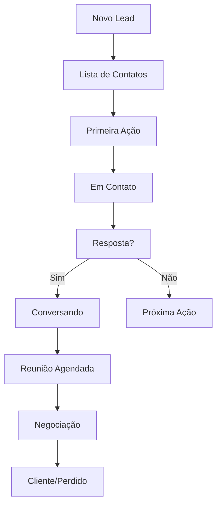

# 📋 Guia do Desenvolvedor - Sistema CRM B2B RecargaPay

## 🎯 Visão Geral

Este é um sistema CRM completo para prospecção B2B desenvolvido em HTML/JavaScript puro. O sistema gerencia leads, cadências de mensagens, relatórios avançados e possui funcionalidades modernas como dark mode e versionamento automático.

## 🏗️ Arquitetura do Sistema

### 📁 Estrutura de Arquivos
```
hunter/
├── crm_analise.html          # Arquivo principal do sistema
├── CONFIG-EXEMPLO.txt        # Exemplo de configuração JSONBin
├── CORREÇÕES-IMPLEMENTADAS.md # Log de correções
├── MENSAGENS-MELHORADAS.md   # Templates de mensagens
└── GUIA-DESENVOLVEDOR.md     # Este guia
```

### 🔧 Tecnologias Utilizadas
- **Frontend**: HTML5, CSS3, JavaScript ES6+
- **Styling**: TailwindCSS (via CDN)
- **Banco de Dados**: JSONBin.io (API REST)
- **Armazenamento Local**: localStorage (preferências e estado)
- **Fontes**: Google Fonts (Inter)

## 🚀 Configuração Inicial

### 1. Credenciais JSONBin.io
No início do arquivo `crm_analise.html`, configure as credenciais:

```javascript
const CONFIG = {
    JSONBIN_API_KEY: "$2a$10$SuaChaveAqui...", // API Key do JSONBin
    JSONBIN_BIN_ID: "SeuBinIdAqui",            // ID do Bin criado
};
```

### 2. Como Obter Credenciais
1. Acesse [jsonbin.io](https://jsonbin.io)
2. Crie uma conta gratuita
3. Gere uma API Key no dashboard
4. Crie um novo "bin" para armazenar os dados
5. Cole as credenciais no objeto `CONFIG`

## 📊 Estrutura de Dados

### Lead Object
```javascript
{
    id: "timestamp_unique",           // ID único
    empresa: "Nome da Empresa",       // Nome da empresa
    nome: "Nome do Contato",          // Nome do contato
    cargo: "Cargo do Contato",        // Cargo na empresa
    linkedin: "https://linkedin...",  // URL do LinkedIn
    status: "Em Contato",             // Status atual
    currentActionIndex: 1,            // Índice da próxima ação
    nextActionDate: "2024-11-25",     // Data da próxima ação
    notes: "Observações...",          // Notas do lead
    history: [],                      // Histórico de mudanças
    createdAt: "2024-11-25T10:00:00Z" // Data de criação
}
```

### Configuração de Cadência
```javascript
{
    statusOptions: [                  // Status disponíveis
        "Lista de Contatos",
        "Em Contato", 
        "Conversando",
        // ...
    ],
    actions: [                        // Ações/mensagens da cadência
        {
            id: 1234567890,           // ID único da ação
            name: "Primeira Mensagem", // Nome da ação
            delayDays: 0,             // Dias após ação anterior
            setsStatusTo: "Em Contato", // Status após execução
            template: "Olá [NOME]..."  // Template da mensagem
        }
        // ...
    ]
}
```

## 🎨 Sistema de Interface

### Layouts Disponíveis
O sistema possui **apenas layout de cards** (layout de tabela foi removido para evitar duplicação):

#### Layout de Cards
- **Localização**: `.mobile-card` div
- **Responsivo**: Funciona em desktop e mobile
- **Funcionalidades**: 
  - Expandir/retrair empresas (setas ▼/▶)
  - Botões de ação inline
  - Edição de status e datas
  - Visualização de próximas ações

### Funcionalidades da Interface

#### 1. Expandir/Retrair Empresas
```css
.company-leads.collapsed { display: none; }
.company-leads.expanded { display: block; }
```

#### 2. Dark Mode
- **Chave localStorage**: `crm_dark_mode`
- **Classes CSS**: `.dark` aplicada ao `<html>`
- **Detecção automática**: Respeita `prefers-color-scheme`

#### 3. Calendário de 14 Dias
- **Dias úteis**: Segunda a sexta-feira
- **Interativo**: Clique para executar ações
- **Visual**: Diferencia hoje, datas com contatos e atrasados

## 🔄 Fluxo de Funcionamento

### 1. Ciclo de Vida de um Lead



### 2. Execução de Ações
1. **Validação**: Verifica se lead pode executar ação
2. **Histórico**: Salva estado anterior
3. **Atualização**: Muda status e próxima ação
4. **Salvamento**: Persiste no JSONBin
5. **Notificação**: Feedback para usuário

### 3. Sistema de Histórico
Cada mudança é salva no array `history` do lead:
```javascript
{
    status: "status_anterior",
    currentActionIndex: 0,
    nextActionDate: "2024-11-25",
    timestamp: "2024-11-25T10:00:00Z",
    action: "tipo_da_acao"
}
```

## 🛠️ Principais Funções

### Renderização
```javascript
renderTable()           // Renderiza interface principal
renderCardsView()       // Renderiza layout de cards
renderConfigForm()      // Renderiza formulário de configuração
```

### Manipulação de Dados
```javascript
loadDataFromBin()       // Carrega dados do JSONBin
saveDataToBin()         // Salva dados no JSONBin
executeAction(id)       // Executa ação de cadência
undoAction(id)          // Desfaz última ação
```

### Interface
```javascript
toggleCompany(name)     // Expande/retrai empresa
updateLeadStatus()      // Atualiza status do lead
openNotesModal()        // Abre modal de notas
generateReport()        // Gera relatórios completos
```

## 📈 Sistema de Relatórios

### Métricas Disponíveis

#### Semanais (7 dias)
- Contatos executados
- Novas reuniões agendadas
- Total de leads ativos
- Taxa de conversão geral

#### Mensais (30 dias)
- Progressão no funil por etapa
- Performance por mensagem/ação
- Taxas de conversão específicas
- Insights automáticos

#### Agenda (14 dias úteis)
- Calendário visual interativo
- Leads agrupados por data
- Ações pendentes destacadas
- Execução direta via clique

### Performance por Mensagem
O sistema analisa automaticamente:
- **Execuções**: Quantas vezes cada mensagem foi enviada
- **Conversões**: Quantas levaram a mudança positiva de status
- **Taxa**: Percentual de sucesso de cada mensagem
- **Insights**: Sugestões automáticas de melhoria

## 🔧 Personalização e Configuração

### Adicionando Novos Status
1. Vá em **Configurações > Gerenciar Status do Funil**
2. Clique em "Adicionar Status"
3. Digite o nome e salve
4. O novo status estará disponível imediatamente

### Criando Nova Ação/Mensagem
1. Vá em **Configurações > Gerenciar Ações da Cadência**
2. Clique em "Adicionar Ação"
3. Configure:
   - Nome da ação
   - Dias de delay
   - Status de destino
   - Template da mensagem (use `[NOME]` e `[EMPRESA]`)

### Templates de Mensagem
Use as variáveis:
- `[NOME]`: Substituído pelo primeiro nome do contato
- `[EMPRESA]`: Substituído pelo nome da empresa

Exemplo:
```
Olá [NOME]!

Sou da RecargaPay e gostaria de conversar sobre como podemos ajudar a [EMPRESA] com...
```

## 🎨 Customização Visual

### Alterando Cores
As cores seguem o padrão TailwindCSS. Para personalizar:

1. **Cores principais**: Edite as classes no HTML
2. **Dark mode**: Modifique o CSS dentro da tag `<style>`
3. **Status cards**: Ajuste as classes `bg-*` e `text-*`

### Adicionando Animações
Use CSS transitions já configuradas:
```css
* {
    transition: background-color 0.3s ease, color 0.3s ease;
}
```

## 🚨 Tratamento de Erros

### Erros Comuns e Soluções

#### 1. "API Key deve começar com $2a$ ou $2b$"
- **Causa**: API Key incorreta ou inválida
- **Solução**: Verifique a chave no dashboard JSONBin

#### 2. "Bin ID parece inválido"
- **Causa**: ID do bin incorreto
- **Solução**: Copie o ID correto do bin criado

#### 3. "Leads duplicados na tabela"
- **Causa**: Renderizações simultâneas
- **Solução**: Sistema possui proteção automática (já resolvido)

#### 4. "Setas não funcionam"
- **Causa**: CSS de visibilidade incorreto
- **Solução**: Verificar classes `.company-leads.collapsed/expanded`

### Debug e Logs
O sistema possui logs detalhados no console:
```javascript
console.log('🔄 Iniciando renderização...');
console.log('✅ Renderização concluída');
console.log('🧹 Limpeza - Leads antes:', x, 'depois:', y);
```

## 🔄 Fluxo de Desenvolvimento

### 1. Fazendo Alterações
```bash
# 1. Editar o arquivo
nano crm_analise.html

# 2. Testar localmente
# Abrir no navegador e verificar funcionalidades

# 3. Adicionar ao git
git add crm_analise.html

# 4. Fazer commit descritivo
git commit -m "🐛 Corrigir problema X

- Descrição da mudança
- Impacto da alteração
- Referência ao bug/issue"

# 5. Enviar para repositório
git push origin main
```

### 2. Padrão de Commits
Use emojis para categorizar:
- 🐛 `:bug:` - Correção de bugs
- ✨ `:sparkles:` - Nova funcionalidade
- 🎨 `:art:` - Melhorias de interface
- 🔧 `:wrench:` - Configurações
- 📝 `:memo:` - Documentação
- 🚀 `:rocket:` - Performance

### 3. Testando Mudanças
Sempre teste:
- [ ] Adicionar novo lead
- [ ] Executar ações da cadência
- [ ] Expandir/retrair empresas
- [ ] Filtros e busca
- [ ] Relatórios e agenda
- [ ] Dark mode toggle
- [ ] Responsividade mobile

## ⚠️ IMPORTANTE: Sempre Fazer Push!

### 🚨 REGRA OBRIGATÓRIA
**TODA mudança deve ser enviada para o repositório GitHub!**

```bash
# SEMPRE após fazer alterações:
git add .
git commit -m "Descrição da mudança"
git push origin main
```

### Por que é importante?
1. **Backup**: Evita perda de código
2. **Colaboração**: Outros podem ver mudanças
3. **Histórico**: Rastrea evolução do projeto
4. **Rollback**: Permite voltar versões anteriores

### Checklist pré-push:
- [ ] Código funcionando localmente
- [ ] Sem erros no console
- [ ] Funcionalidades principais testadas
- [ ] Commit message descritiva
- [ ] Push realizado com sucesso

## 🎯 Funcionalidades Avançadas

### Sistema de Versionamento
- **Automático**: Detecta mudanças e incrementa versão
- **Histórico visual**: Modal com changelog
- **Debug**: Use `window.debugVersion()` no console

### Exportação Excel
- **Formato**: CSV com separador `;`
- **Conteúdo**: Todos os dados dos leads
- **Nome**: `backup_prospeccao_YYYY-MM-DD.csv`

### Busca e Filtros
- **Debounce**: 300ms para otimizar performance
- **Campos**: Empresa e nome do contato
- **Status**: Filtro por status específico

### Backup Automático
- **Frequência**: A cada salvamento
- **Limpeza**: Remove leads duplicados automaticamente
- **Validação**: Verifica integridade dos dados

## 🔐 Segurança e Boas Práticas

### Dados Sensíveis
1. **Nunca** commitar API keys reais
2. Use arquivo `.env` em produção
3. Configure `.gitignore` apropriado

### Performance
1. Use `debouncing` para buscas
2. Limite renderizações simultâneas
3. Limpe dados duplicados regularmente

### Acessibilidade
1. Mantenha `title` attributes nos botões
2. Use cores com contraste adequado
3. Teste navegação por teclado

## 🆘 Suporte e Troubleshooting

### Logs de Debug
No console do navegador:
```javascript
// Ver estado atual
console.log('Leads:', leads);
console.log('Config:', cadenceConfig);
console.log('Empresa expandida:', companyExpandedState);

// Debug de versão
window.debugVersion();

// Forçar re-renderização
renderTable();
```

### Reset de Dados
Se necessário, limpar dados locais:
```javascript
localStorage.clear();
location.reload();
```

### Contatos para Suporte
- **Repositório**: [GitHub - neighbor14/Hunter](https://github.com/neighbor14/Hunter)
- **Issues**: Use o sistema de issues do GitHub
- **Documentação**: Este arquivo sempre atualizado

---

## 📝 Changelog Recente

### v2.5.0 - Dark Mode Profissional
- ✨ Sistema completo de dark mode
- 🎯 Toggle inteligente com detecção automática
- 🎨 Paleta de cores profissional
- 💾 Persistência de preferências

### v2.4.0 - Sistema de Versionamento
- 📋 Histórico visual de versões
- 🚀 Versionamento automático
- 🎨 Modal moderno integrado
- ⏰ Botão no header principal

### v2.3.0 - Correções de Layout
- 🐛 Corrigidas empresas duplicadas
- 🔧 Restaurada funcionalidade de expandir/retrair
- ↶ Botão "Desfazer" em todos os leads
- 🎨 Layout único de cards

---

**⚠️ LEMBRE-SE: Sempre faça `git push` após mudanças!**

**📍 Localização do Repositório**: https://github.com/neighbor14/Hunter
